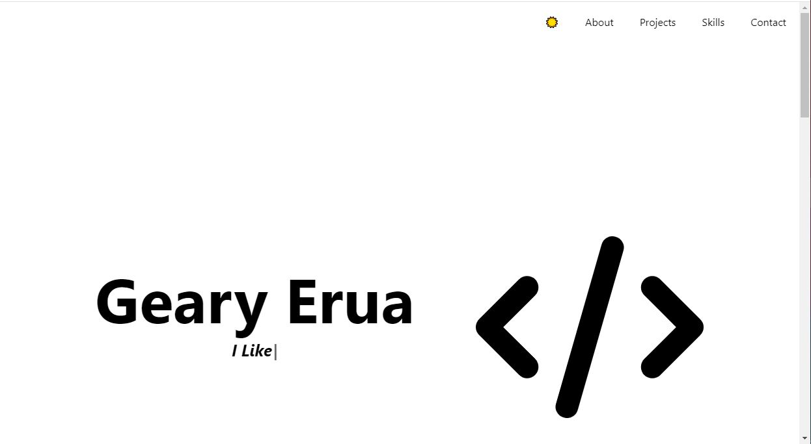
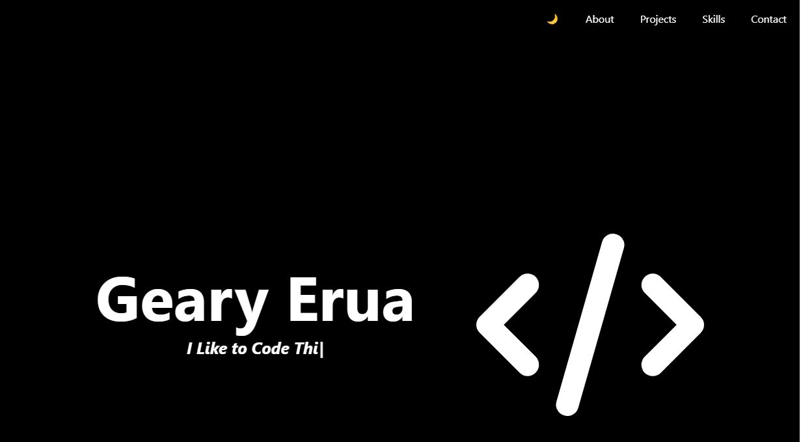
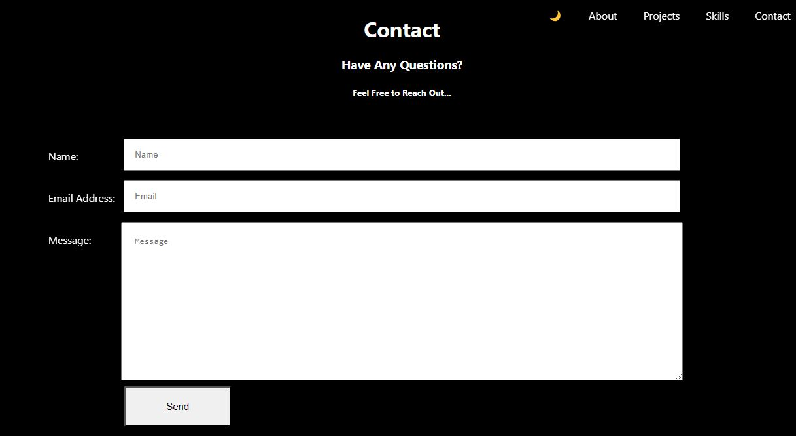

# ReadMe: #

# About: #
Hello, this is a guide on navigating through my Personal Portfolio
website! The application was implemented using React.js, which is a
JavaScript library used to build beautiful UI interfaces. 

Tools Used: The application was created through the assistance of Visual
Studio Code, which is a powerful code editor used by Software Developers.

# Features: #

## Feature One: Responsive Design ##

The use of Responsive design has been implemented through the use of
Media Queries in CSS, and the application fits well on all platforms,
from devices such as iPhone SE to a Nest Hub Max.

## Feature Two: Dark Mode ##

The use of Dark Mode has been implemented through React.js and CSS.
While using the Dark Mode feature, you as the user have the ability
to change modes for the color theme, either light or dark. Here is a 
demonstration:

### Light Mode: ###

### Dark Mode: ###

## Feature Three: Contact Form ##

A contact form has been implemented with the ability of the user to
send messages to the website owner through the use of a JavaScript library
called EmailJS. EmailJS is a JavaScript library that helps send emails 
without the use of any server side technologies.

### Contact Form: ###

## Feature Four: Social Media Engagement ##

The feature of Social Media Engagement has been implemented and the display of the social media 
towards the bottom of the page, showing the LinkedIn link.

## Feature Five: Dynamic Project Showcase ##

The feature of adding a Dynamic Project Showcase has been implemented through the use
of CSS Grid.

# Future Plans: #
This website is under continuous development and maintenance,  and there are plans to add new 
features. Stay tuned for them!